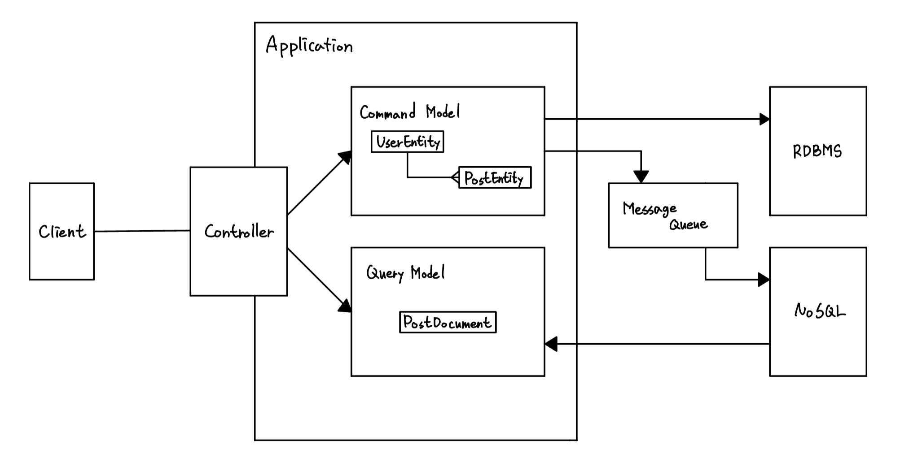

# ONeul(오늘)
One Day Lifetime SNS

## Development Goals
- Delete post 24 hours old using Spring Batch
- Managing Logins Using Session
- Object Oriented Programming 
- [CQRS(Command and Query Responsibility Segregation) Structure](https://zzzinho.tistory.com/123)
- RESTful API
- [Unit Test](https://mangkyu.tistory.com/143)
  
## Application Structure
### CQRS and Event Sourcing
<p align="center"></p>

### Directory Structure
[Domain Directory Structure](https://github.com/cheese10yun/spring-guide/blob/master/docs/directory-guide.md)
```
└── src
    ├── main
    │   ├── java
    │   │   └── com
    │   │       └── example
    │   │           └── onuel
    │   │               ├── OneulApplication.java
    │   │               ├── domain
    │   │               │   ├── user
    │   │               │   │   ├── controller
    │   │               │   │   ├── service
    │   │               │   │   ├── repository
    │   │               │   │   ├── domain
    │   │               │   │   ├── dto
    │   │               │   │   └── exception
    │   │               │   ├── post
    │   │               │   │   ├── controller
    │   │               │   │   ├── service
    │   │               │   │   │   ├── command
    │   │               │   │   │   └── query                            
    │   │               │   │   ├── repository
    │   │               │   │   ├── domain
    │   │               │   │   ├── dto
    │   │               │   │   └── exception
    │   │               ├── global
    │   │               │   ├── common
    │   │               │   │   ├── request
    │   │               │   │   └── response
    │   │               │   ├── config
    │   │               │   │   ├── RedisConfig.java
    │   │               │   │   ├── BatchConfig.java
    │   │               │   │   ├── MongoConfig.java
    │   │               │   │   └── security
    │   │               │   │       ├── InterceptorConfig.java
    │   │               │   │       └── WebSecurityConfig.java 
    │   │               │   ├── error
    │   │               │   │   ├── GlobalExceptionHandler.java
    │   │               │   │   └── exception
    │   │               │   │       ├── NotFoundException.java
    │   │               │   └── util
    │   │               │       ├── LoginCheckInterceptor.java
    │   │               │       └── BatchScheduler.java
    │   │               └── infra
    │   │                   ├── config
    │   │                   │   ├── KafkaConsumerConfig.java
    │   │                   │   └── KafkaProducerConfig.java
    │   │                   ├── dto
    │   │                   │   └── PostMessage.java
    │   │                   └── kafka
    │   │                       ├── KafkaPublisher.java
    │   │                       └── KafkaSubscriber.java
    │   └── resources
    │       ├── application-local.yml
    │       ├── application-prod.yml
    │       ├── application-test.yml
    │       └── application.yml

```
## How to run
```bash
git clone https://github.com/zzzinho/Oneul.git
gradle bootJar
docker compose up --build
```
